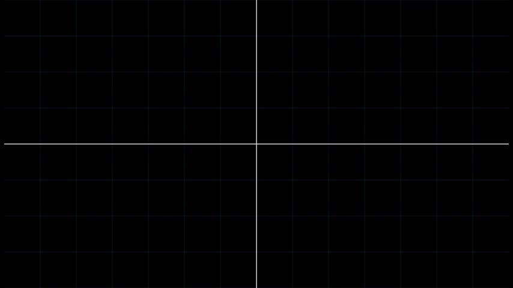
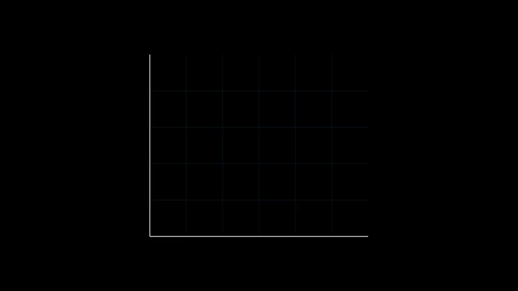

# Summer Reading Program (Lattice Point Problem)

## About

This work was done during the summer reading program (SRP) at the University of British Columbia Mathematics department. The aim of the SRP is to introduce undergraduate students to topics that usually are not covered until graduate level. The topic we specifically devled into is the lattice point problem (LPP).

## Lattice Point Problem

The problem can be describe as below. Let $tD$ be the disk of radius $t$ in the $\mathbb{R}^2$ plane (i.e. $D$ is the unit disk, etc.). Let

$$N(t) := |\{tD \cap \mathbb{Z}^2\}|.$$

So $N(t)$ is the number of lattice points contained in the disk of radius $t$. Intuitively, $N(t) \approx \pi t^2$ or $N(t) = \pi t^2 + E(t)$. The goal is then to find a bound for $E(t)$. This version of problem (also referred to as the "Gauss Circle" problem) is the one we focused on, but there are many different version that consider other shapes and dimensions.

The goal of modern research on the topic is to find a bound on $E(t)$. Godfrey Harold Hardy, a British mathematician of the 19-20th century, conjectured that the bound is 
$$|E(t)| \leq C_\epsilon t^{\frac{1}{2}+\epsilon}$$

for any $\epsilon>0$. Currently, the best bound we know of is $E(t) \leq Ct^q$, with 

$$\frac{1}{2} < q \leq \theta,$$

where $\theta \approx 0.3144$ and $-\theta$ is the unique solution to the equation
$$-\frac{8}{25}x-\frac{1}{200}\left(\sqrt{2(1-14x)}-5\sqrt{-1-8x}\right)^2+\frac{51}{200} = -x.$$
The lower bound was found by Hardy in 1915, and the upper bound by Xiaochun Li and Xuerui Yang in 2023 (look at SRP_Report.pdf for more information).

Our reading was based on Alex Iosevich's "A View from the Top:  Analysis, Combinatorics and Number Theory", specifically chapters 11 and 12. The endpoint and goal of those chapter is to prove a theorem established by Wacław Sierpiński in 1903: 

$$|E(t)| \leq Ct^\frac{2}{3}$$

binding the aforementioned error term.

**Exercise 12.2 form Alex Iosevich's book.** 

Let $\chi_tD(x):\mathbb{Z}^2 \to \{0,1\}$ s.t. $\chi_tD(x) = 1$ if $x$ is in the disk of radius $t$ centered at $(0,0)$ in the $\mathbb{Z}^2$, and $0$ otherwise. Define

$$
\begin{align}
    N(t) &= \sum_{n\in\mathbb{Z}^2} \chi_t D(n) \\
    N(t,x) &= \sum_{n\in\mathbb{Z}^2} \chi_t D(x-n)
\end{align}
$$

For $x\in\mathbb{R}^2$. Our goal is to show that $N(t,x)$ is a periodic function. More explicitly, $N(t,x) = N(t,x+m)$ for any $m\in\mathbb{Z}^2$.

$$
\begin{align}
    N(t,x+m) &= \sum_{n\in\mathbb{Z}^2} \chi_tD(x+m-n) \\
    &= \sum_{l\in\mathbb{Z}^2} \chi_tD(x-l) &\text{Let $l = n-m\in\mathbb{Z}^2$}\\
    &= \sum_{n\in\mathbb{Z}^2} \chi_tD(x-n) = N(t,x)
\end{align}
$$

If we change the coordinates of our center $x$ (in $\mathbb{R}^2$) by integer values, the disk at the new center contains the same number of lattice points as the one before the move.